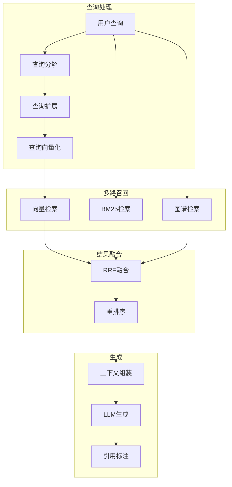

# MindNest AI 系统设计文档

> 构建本地优先的 AI 第二大脑

---

## 1. 系统架构概览

### 1.1 AI 架构分层

```
┌─────────────────────────────────────────────────────────────────┐
│                      应用层 (Application)                        │
│  ┌──────────────┐ ┌──────────────┐ ┌──────────────────────────┐ │
│  │ AI 写作助手   │ │ 智能问答      │ │ 知识洞察引擎              │ │
│  │ (Inline)     │ │ (Chat)       │ │ (Insights)               │ │
│  └──────┬───────┘ └──────┬───────┘ └───────────┬──────────────┘ │
├─────────┼────────────────┼────────────────────┼────────────────┤
│         │                │                    │                │
│  ┌──────▼───────┐ ┌──────▼───────┐ ┌──────────▼──────────┐     │
│  │   RAG 引擎    │ │   意图理解    │ │    知识推理          │     │
│  │  (Pipeline)  │ │  (Intent)    │ │   (Reasoning)       │     │
│  └──────┬───────┘ └──────────────┘ └─────────────────────┘     │
├─────────┼──────────────────────────────────────────────────────┤
│         │                                                      │
│  ┌──────▼──────────────────────────────────────────────────┐   │
│  │                   模型编排层 (Orchestration)              │   │
│  │  ┌────────────┐  ┌────────────┐  ┌────────────────────┐  │   │
│  │  │ Local LLM  │  │ Cloud API  │  │ Embedding Service  │  │   │
│  │  │ Router     │  │ Router     │  │ (Local/Remote)     │  │   │
│  │  └────────────┘  └────────────┘  └────────────────────┘  │   │
│  └──────────────────────────────────────────────────────────┘   │
├─────────────────────────────────────────────────────────────────┤
│                      基础设施层 (Infrastructure)                  │
│  ┌──────────────┐ ┌──────────────┐ ┌──────────────────────────┐ │
│  │ Vector Store │ │  LLM Runtime │ │    Model Management      │ │
│  │  (LanceDB)   │ │ (candle/ort) │ │  (Download/Cache/Quant)  │ │
│  └──────────────┘ └──────────────┘ └──────────────────────────┘ │
└─────────────────────────────────────────────────────────────────┘
```

### 1.2 核心设计原则

1. **本地优先**: 敏感数据处理完全本地，无需联网
2. **渐进增强**: 从本地小模型到云端大模型，按需升级
3. **上下文感知**: 基于用户知识库的个性化回答
4. **可解释性**: 所有 AI 回答可追溯来源

---

## 2. RAG (检索增强生成) 系统

### 2.1 检索流程



### 2.2 文档向量化策略

```rust
// 文档分片配置
struct ChunkingConfig {
    // 基础配置
    chunk_size: usize,      // 512 tokens
    chunk_overlap: usize,   // 50 tokens
    
    // 语义边界
    split_by: Vec<SplitBoundary>,
    
    // 特殊处理
    code_blocks: CodeBlockPolicy,
    tables: TablePolicy,
}

enum SplitBoundary {
    Heading,      // 优先按标题分割
    Paragraph,    // 段落边界
    Sentence,     // 句子边界
}

// 分片元数据
struct DocumentChunk {
    id: String,
    document_id: String,
    chunk_index: usize,
    
    // 内容
    text: String,
    embedding: Vec<f32>,
    
    // 上下文信息
    prev_chunk: Option<String>,  // 前一片段摘要
    next_chunk: Option<String>,  // 后一片段摘要
    
    // 元数据
    metadata: ChunkMetadata,
}

struct ChunkMetadata {
    title: String,
    headings: Vec<String>,  // 层级标题
    tags: Vec<String>,
    created_at: DateTime,
    doc_type: DocumentType,
}
```

### 2.3 混合检索实现

```rust
pub struct HybridSearcher {
    // 向量数据库
    vector_store: Arc<LanceVectorStore>,
    
    // 全文搜索引擎
    text_search: Arc<TantivyEngine>,
    
    // 图谱引擎
    graph_engine: Arc<GraphEngine>,
    
    // 重排序模型
    reranker: Arc<LocalReranker>,
}

impl HybridSearcher {
    pub async fn search(&self, query: &str, top_k: usize) -> Result<Vec<SearchResult>> {
        // 1. 并行执行多路检索
        let (vector_results, text_results, graph_results) = tokio::join!(
            self.vector_search(query, top_k * 2),
            self.text_search(query, top_k * 2),
            self.graph_search(query, top_k),
        );
        
        // 2. RRF 融合
        let fused = self.reciprocal_rank_fusion(
            vector_results?,
            text_results?,
            graph_results?,
        );
        
        // 3. 重排序
        let reranked = self.rerank(query, fused, top_k).await?;
        
        Ok(reranked)
    }
    
    // RRF (Reciprocal Rank Fusion)
    fn reciprocal_rank_fusion(
        &self,
        vector: Vec<ScoredDocument>,
        text: Vec<ScoredDocument>,
        graph: Vec<ScoredDocument>,
    ) -> Vec<ScoredDocument> {
        let k = 60.0;  // RRF 常数
        let mut scores: HashMap<String, f32> = HashMap::new();
        
        // 合并所有结果的排名分数
        for (rank, doc) in vector.iter().enumerate() {
            *scores.entry(doc.id.clone()).or_insert(0.0) += 1.0 / (k + rank as f32);
        }
        for (rank, doc) in text.iter().enumerate() {
            *scores.entry(doc.id.clone()).or_insert(0.0) += 1.0 / (k + rank as f32);
        }
        for (rank, doc) in graph.iter().enumerate() {
            *scores.entry(doc.id.clone()).or_insert(0.0) += 1.0 / (k + rank as f32);
        }
        
        // 按分数排序
        let mut results: Vec<_> = scores.into_iter().collect();
        results.sort_by(|a, b| b.1.partial_cmp(&a.1).unwrap());
        
        results.into_iter()
            .map(|(id, score)| ScoredDocument { id, score })
            .collect()
    }
}
```

### 2.4 向量数据库 (LanceDB)

```rust
use lancedb::{connect, Table, TableRef};
use arrow_array::{Float32Array, StringArray, RecordBatch};
use arrow_schema::{DataType, Field, Schema};

pub struct VectorStore {
    table: TableRef,
    embedding_model: Arc<dyn EmbeddingModel>,
}

impl VectorStore {
    pub async fn new(db_path: &str, model: Arc<dyn EmbeddingModel>) -> Result<Self> {
        let db = connect(db_path).execute().await?;
        
        // 定义表结构
        let schema = Arc::new(Schema::new(vec![
            Field::new("id", DataType::Utf8, false),
            Field::new("document_id", DataType::Utf8, false),
            Field::new("chunk_index", DataType::Int32, false),
            Field::new("text", DataType::Utf8, false),
            Field::new("embedding", DataType::FixedSizeList(
                Arc::new(Field::new("item", DataType::Float32, true)),
                1024  // bge-m3 维度
            ), false),
            Field::new("metadata", DataType::Utf8, true),
        ]));
        
        let table = db.create_table("document_chunks", schema, None).execute().await?;
        
        Ok(Self { table, embedding_model: model })
    }
    
    pub async fn add_document(&self, doc: &Document) -> Result<()> {
        // 1. 分片
        let chunks = self.chunk_document(doc);
        
        // 2. 向量化
        let embeddings = self.embedding_model.embed_batch(
            chunks.iter().map(|c| c.text.as_str()).collect()
        ).await?;
        
        // 3. 写入数据库
        let batch = RecordBatch::try_new(
            self.table.schema(),
            vec![
                Arc::new(StringArray::from(chunks.iter().map(|c| c.id.clone()).collect::<Vec<_>>())),
                Arc::new(StringArray::from(chunks.iter().map(|c| c.document_id.clone()).collect::<Vec<_>>())),
                Arc::new(Int32Array::from(chunks.iter().map(|c| c.chunk_index as i32).collect::<Vec<_>>())),
                Arc::new(StringArray::from(chunks.iter().map(|c| c.text.clone()).collect::<Vec<_>>())),
                Arc::new(Float32Array::from(embeddings.concat())),
            ]
        )?;
        
        self.table.add(batch).execute().await?;
        
        // 4. 创建索引
        self.table.create_index(
            &["embedding"],
            lancedb::index::Index::IvfPq(
                lancedb::index::IvfPqIndexBuilder::default()
                    .num_partitions(256)
                    .num_sub_vectors(96)
            )
        ).execute().await?;
        
        Ok(())
    }
    
    pub async fn search(&self, query: &str, top_k: usize) -> Result<Vec<SearchResult>> {
        // 1. 查询向量化
        let query_embedding = self.embedding_model.embed(query).await?;
        
        // 2. 向量搜索
        let results = self.table
            .search(&query_embedding)
            .limit(top_k)
            .execute()
            .await?;
        
        // 3. 解析结果
        let mut search_results = Vec::new();
        for batch in results {
            let ids = batch.column(0).as_string::<i32>();
            let texts = batch.column(3).as_string::<i32>();
            let scores = batch.column_by_name("_distance").unwrap().as_primitive::<Float32Type>();
            
            for i in 0..batch.num_rows() {
                search_results.push(SearchResult {
                    id: ids.value(i).to_string(),
                    text: texts.value(i).to_string(),
                    score: scores.value(i),
                });
            }
        }
        
        Ok(search_results)
    }
}
```

---

## 3. 本地模型管理

### 3.1 模型配置

```yaml
# models.yml
models:
  # 嵌入模型
  embeddings:
    bge-m3:
      name: "BAAI/bge-m3"
      dimensions: 1024
      max_tokens: 8192
      languages: ["zh", "en", "multilingual"]
      size: "2GB"
      quantization: "Q4_0"
      
    nomic-embed-text-v1.5:
      name: "nomic-ai/nomic-embed-text-v1.5"
      dimensions: 768
      max_tokens: 2048
      languages: ["en"]
      size: "500MB"
      quantization: "Q4_0"

  # 本地 LLM
  llm:
    phi-4:
      name: "microsoft/phi-4"
      parameters: "14B"
      context_length: 16384
      size: "8GB"
      quantization: "Q4_K_M"
      capabilities: ["chat", "summarize", "code"]
      
    qwen2.5-7b-instruct:
      name: "Qwen/Qwen2.5-7B-Instruct"
      parameters: "7B"
      context_length: 32768
      size: "4GB"
      quantization: "Q4_K_M"
      capabilities: ["chat", "summarize", "translate"]
      languages: ["zh", "en"]
      
    gemma-2-9b-it:
      name: "google/gemma-2-9b-it"
      parameters: "9B"
      context_length: 8192
      size: "5GB"
      quantization: "Q4_K_M"
      capabilities: ["chat", "reasoning"]

  # 重排序模型
  reranker:
    bge-reranker-v2-m3:
      name: "BAAI/bge-reranker-v2-m3"
      size: "2GB"
```

### 3.2 模型下载与缓存

```rust
pub struct ModelManager {
    cache_dir: PathBuf,
    http_client: reqwest::Client,
    download_progress: Arc<DashMap<String, DownloadProgress>>,
}

impl ModelManager {
    pub async fn download_model(&self, model_id: &str) -> Result<PathBuf> {
        let config = self.get_model_config(model_id)?;
        let model_dir = self.cache_dir.join(model_id);
        
        // 检查是否已存在
        if model_dir.exists() {
            return Ok(model_dir);
        }
        
        tokio::fs::create_dir_all(&model_dir).await?;
        
        // 从 Hugging Face 下载
        let url = format!(
            "https://huggingface.co/{}/resolve/main/",
            config.name
        );
        
        // 下载模型文件
        let files = self.list_model_files(&config.name).await?;
        for file in files {
            let file_url = format!("{}{}", url, file);
            let file_path = model_dir.join(&file);
            
            self.download_file_with_progress(&file_url, &file_path, model_id).await?;
        }
        
        Ok(model_dir)
    }
    
    pub fn get_model_path(&self, model_id: &str) -> Option<PathBuf> {
        let path = self.cache_dir.join(model_id);
        if path.exists() {
            Some(path)
        } else {
            None
        }
    }
}
```

---

## 4. AI 功能模块

### 4.1 写作助手

```rust
pub struct WritingAssistant {
    llm: Arc<dyn LLM>,
    knowledge_base: Arc<KnowledgeBase>,
}

impl WritingAssistant {
    /// 智能续写
    pub async fn continue_writing(&self, context: &str) -> Result<Stream<String>> {
        let prompt = format!(
            r#"基于以下上下文，继续写作。保持风格一致，自然流畅：

上下文：
{}

续写："#,
            context
        );
        
        self.llm.generate_stream(&prompt).await
    }
    
    /// 文本润色
    pub async fn polish(&self, text: &str, style: WritingStyle) -> Result<String> {
        let style_prompt = match style {
            WritingStyle::Concise => "更简洁",
            WritingStyle::Professional => "更专业",
            WritingStyle::Casual => "更口语化",
            WritingStyle::Academic => "更学术",
        };
        
        let prompt = format!(
            r#"请润色以下文本，使其{}。保持原意，只输出润色后的文本：

{}"#,
            style_prompt, text
        );
        
        self.llm.generate(&prompt).await
    }
    
    /// 摘要生成
    pub async fn summarize(&self, text: &str, max_length: usize) -> Result<String> {
        let prompt = format!(
            r#"请为以下文本生成摘要，最多{}字：

{}"#,
            max_length, text
        );
        
        self.llm.generate(&prompt).await
    }
}
```

### 4.2 知识问答

```rust
pub struct KnowledgeQA {
    searcher: Arc<HybridSearcher>,
    llm: Arc<dyn LLM>,
}

impl KnowledgeQA {
    pub async fn ask(&self, question: &str, kb_id: &str) -> Result<Answer> {
        // 1. 检索相关文档
        let relevant_docs = self.searcher.search(question, 10).await?;
        
        // 2. 组装上下文
        let context = self.build_context(&relevant_docs).await?;
        
        // 3. 生成回答
        let prompt = format!(
            r#"基于以下参考资料回答问题。如果资料不足，请明确说明。

参考资料：
{}

问题：{}

请用中文回答，并在回答后列出引用的文档："#,
            context, question
        );
        
        let answer_text = self.llm.generate(&prompt).await?;
        
        // 4. 提取引用
        let citations = self.extract_citations(&answer_text, &relevant_docs);
        
        Ok(Answer {
            text: answer_text,
            citations,
            sources: relevant_docs.into_iter().take(5).collect(),
        })
    }
}

pub struct Answer {
    pub text: String,
    pub citations: Vec<Citation>,
    pub sources: Vec<Document>,
}
```

### 4.3 知识洞察

```rust
pub struct InsightEngine {
    graph: Arc<GraphEngine>,
    llm: Arc<dyn LLM>,
}

impl InsightEngine {
    /// 发现隐藏关联
    pub async fn find_connections(&self, doc_id: &str) -> Result<Vec<Connection>> {
        let doc = self.graph.get_document(doc_id)?;
        
        // 1. 获取邻居节点
        let neighbors = self.graph.get_neighbors(doc_id, 2)?;
        
        // 2. 使用图算法发现潜在关联
        let potential = self.graph.find_potential_links(doc_id)?;
        
        // 3. 使用 LLM 验证和解释关联
        let mut connections = Vec::new();
        for candidate in potential {
            if let Some(explanation) = self.validate_connection(&doc, &candidate).await? {
                connections.push(Connection {
                    target: candidate,
                    explanation,
                    confidence: 0.85,
                });
            }
        }
        
        Ok(connections)
    }
    
    /// 每日回顾
    pub async fn daily_review(&self) -> Result<DailyReview> {
        let today = Local::now();
        
        // 1. 历史上的今天
        let on_this_day = self.get_documents_by_date(
            today.month(), 
            today.day()
        ).await?;
        
        // 2. 随机漫步
        let random_walk = self.graph.random_walk(5)?;
        
        // 3. 待完善笔记
        let incomplete = self.find_incomplete_notes().await?;
        
        // 4. 知识趋势
        let trends = self.analyze_knowledge_trends().await?;
        
        Ok(DailyReview {
            on_this_day,
            random_walk,
            incomplete,
            trends,
        })
    }
}
```

---

## 5. 模型路由策略

### 5.1 智能路由

```rust
pub struct ModelRouter {
    local_llm: Arc<dyn LLM>,
    cloud_client: Option<CloudLLMClient>,
    config: RouterConfig,
}

#[derive(Clone)]
pub struct RouterConfig {
    /// 默认模式
    pub default_mode: ModelMode,
    
    /// 是否允许回退到云端
    pub allow_cloud_fallback: bool,
    
    /// 任务类型到模型的映射
    pub task_routing: HashMap<TaskType, ModelPreference>,
}

#[derive(Clone, Copy)]
pub enum ModelMode {
    LocalOnly,
    CloudPreferred,
    Auto,  // 根据任务复杂度自动选择
}

impl ModelRouter {
    pub async fn route(&self, task: &Task) -> Result<Arc<dyn LLM>> {
        match self.config.default_mode {
            ModelMode::LocalOnly => Ok(self.local_llm.clone()),
            
            ModelMode::CloudPreferred => {
                if let Some(cloud) = &self.cloud_client {
                    if cloud.is_available().await? {
                        return Ok(Arc::new(cloud.clone()));
                    }
                }
                Ok(self.local_llm.clone())
            }
            
            ModelMode::Auto => {
                let preference = self.config.task_routing
                    .get(&task.task_type)
                    .cloned()
                    .unwrap_or(ModelPreference::Local);
                
                match preference {
                    ModelPreference::Local => Ok(self.local_llm.clone()),
                    ModelPreference::Cloud => {
                        if let Some(cloud) = &self.cloud_client {
                            Ok(Arc::new(cloud.clone()))
                        } else {
                            Ok(self.local_llm.clone())
                        }
                    }
                    ModelPreference::Hybrid => {
                        // 先用本地模型快速响应，再用云端模型优化
                        Ok(self.local_llm.clone())
                    }
                }
            }
        }
    }
}
```

---

## 6. 性能优化

### 6.1 推理优化

```rust
// 批处理
pub struct BatchProcessor {
    queue: Arc<Mutex<Vec<EmbeddingRequest>>>,
    batch_size: usize,
    timeout: Duration,
}

impl BatchProcessor {
    pub async fn process(&self) {
        loop {
            let batch = self.collect_batch().await;
            if !batch.is_empty() {
                self.process_batch(batch).await;
            }
        }
    }
    
    async fn process_batch(&self, batch: Vec<EmbeddingRequest>) {
        // 合并批处理，提高 GPU 利用率
        let texts: Vec<_> = batch.iter().map(|r| r.text.clone()).collect();
        let embeddings = self.model.embed_batch(&texts).await;
        
        // 分发结果
        for (req, emb) in batch.iter().zip(embeddings.iter()) {
            let _ = req.response_tx.send(emb.clone());
        }
    }
}

// 缓存策略
pub struct EmbeddingCache {
    cache: Arc<DashMap<String, (Vec<f32>, Instant)>>,
    ttl: Duration,
}

impl EmbeddingCache {
    pub async fn get_or_compute<F>(
        &self,
        key: &str,
        compute: F,
    ) -> Result<Vec<f32>>
    where
        F: FnOnce() -> Result<Vec<f32>>,
    {
        // 检查缓存
        if let Some((emb, time)) = self.cache.get(key) {
            if time.elapsed() < self.ttl {
                return Ok(emb.clone());
            }
        }
        
        // 计算并缓存
        let emb = compute()?;
        self.cache.insert(key.to_string(), (emb.clone(), Instant::now()));
        
        Ok(emb)
    }
}
```

---

## 7. 隐私与安全

### 7.1 本地数据处理

```rust
pub enum DataPrivacyLevel {
    /// 完全本地处理
    LocalOnly,
    
    /// 匿名化处理后可上传
    Anonymized,
    
    /// 用户明确同意后上传
    ExplicitConsent,
}

pub struct PrivacyGuard {
    level: DataPrivacyLevel,
}

impl PrivacyGuard {
    pub fn can_upload_to_cloud(&self, data: &str) -> bool {
        match self.level {
            DataPrivacyLevel::LocalOnly => false,
            DataPrivacyLevel::Anonymized => {
                // 检查是否包含 PII
                !self.contains_pii(data)
            }
            DataPrivacyLevel::ExplicitConsent => {
                // 检查用户是否已授权
                self.has_explicit_consent()
            }
        }
    }
    
    fn contains_pii(&self, data: &str) -> bool {
        // 使用本地 NER 检测 PII
        // 检测：邮箱、电话、身份证号等
        false
    }
}
```

---

## 8. 监控与指标

```rust
pub struct AITelemetry {
    /// 推理延迟
    pub inference_latency: Histogram,
    
    /// 检索质量
    pub retrieval_precision: Counter,
    pub retrieval_recall: Counter,
    
    /// 生成质量（用户反馈）
    pub generation_positive_feedback: Counter,
    pub generation_negative_feedback: Counter,
    
    /// 资源使用
    pub gpu_memory_usage: Gauge,
    pub cpu_usage: Gauge,
}
```

---

## 9. 未来扩展

1. **多模态支持**: 图像理解、语音输入
2. **Agent 能力**: 自动整理、智能提醒
3. **协作 AI**: 多人知识库的智能合并
4. **个性化微调**: 基于用户数据的 LoRA 微调
