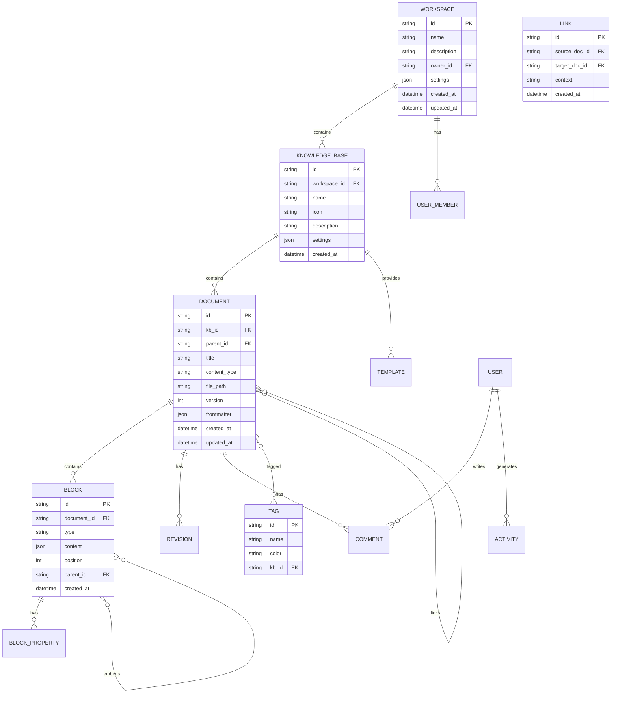

# MindNest 数据模型设计

> 定义核心实体的数据结构、关系和存储格式

---

## 1. 实体关系图 (ERD)



---

## 2. SQLite 数据库 Schema

### 2.1 工作区与权限

```sql
-- 工作区
CREATE TABLE workspaces (
    id TEXT PRIMARY KEY,  -- nanoid (21 chars)
    name TEXT NOT NULL,
    description TEXT,
    owner_id TEXT NOT NULL,  -- 本地用户ID或外部Auth ID
    icon TEXT,  -- emoji 或图标URL
    settings JSON DEFAULT '{}',
    created_at DATETIME DEFAULT CURRENT_TIMESTAMP,
    updated_at DATETIME DEFAULT CURRENT_TIMESTAMP
);

-- 知识库 (类似 Obsidian Vault / Notion Workspace)
CREATE TABLE knowledge_bases (
    id TEXT PRIMARY KEY,
    workspace_id TEXT NOT NULL REFERENCES workspaces(id) ON DELETE CASCADE,
    name TEXT NOT NULL,
    description TEXT,
    icon TEXT DEFAULT '📚',
    color TEXT,  -- 主题色
    storage_path TEXT NOT NULL,  -- 本地存储路径
    settings JSON DEFAULT '{
        "defaultTemplate": null,
        "autoTag": false,
        "syncEnabled": false
    }',
    created_at DATETIME DEFAULT CURRENT_TIMESTAMP,
    updated_at DATETIME DEFAULT CURRENT_TIMESTAMP
);

-- 成员与权限 (本地多用户或协作)
CREATE TABLE members (
    id TEXT PRIMARY KEY,
    workspace_id TEXT NOT NULL REFERENCES workspaces(id) ON DELETE CASCADE,
    user_id TEXT NOT NULL,
    role TEXT CHECK(role IN ('owner', 'admin', 'editor', 'commenter', 'viewer')),
    joined_at DATETIME DEFAULT CURRENT_TIMESTAMP
);

-- API Keys / 集成令牌
CREATE TABLE api_keys (
    id TEXT PRIMARY KEY,
    workspace_id TEXT NOT NULL REFERENCES workspaces(id) ON DELETE CASCADE,
    name TEXT NOT NULL,
    key_hash TEXT NOT NULL,  -- 存储哈希值
    permissions JSON DEFAULT '[]',
    expires_at DATETIME,
    last_used_at DATETIME,
    created_at DATETIME DEFAULT CURRENT_TIMESTAMP
);
```

### 2.2 文档与内容

```sql
-- 文档 (元数据)
CREATE TABLE documents (
    id TEXT PRIMARY KEY,
    kb_id TEXT NOT NULL REFERENCES knowledge_bases(id) ON DELETE CASCADE,
    parent_id TEXT REFERENCES documents(id) ON DELETE CASCADE,
    
    -- 基本信息
    title TEXT NOT NULL,
    slug TEXT,  -- URL友好的别名
    
    -- 内容存储
    content_type TEXT DEFAULT 'markdown',  -- markdown, database, canvas
    file_path TEXT NOT NULL,  -- 相对kb路径
    file_size INTEGER DEFAULT 0,
    checksum TEXT,  -- SHA256, 用于检测变更
    
    -- 版本控制
    version INTEGER DEFAULT 1,
    latest_revision_id TEXT,
    
    --  frontmatter 元数据
    frontmatter JSON DEFAULT '{}',
    
    -- 统计信息
    word_count INTEGER DEFAULT 0,
    reading_time INTEGER DEFAULT 0,  -- 分钟
    
    -- 状态
    status TEXT DEFAULT 'active' CHECK(status IN ('active', 'archived', 'deleted')),
    is_pinned BOOLEAN DEFAULT FALSE,
    is_favorite BOOLEAN DEFAULT FALSE,
    
    -- 时间戳
    created_at DATETIME DEFAULT CURRENT_TIMESTAMP,
    updated_at DATETIME DEFAULT CURRENT_TIMESTAMP,
    archived_at DATETIME,
    
    -- 索引
    INDEX idx_kb_parent (kb_id, parent_id),
    INDEX idx_updated (updated_at),
    INDEX idx_status (status),
    FULLTEXT INDEX idx_title (title)
);

-- 块级内容 (可选，用于数据库类型或精细化查询)
CREATE TABLE blocks (
    id TEXT PRIMARY KEY,
    document_id TEXT NOT NULL REFERENCES documents(id) ON DELETE CASCADE,
    
    -- 块类型
    type TEXT NOT NULL CHECK(type IN (
        'paragraph', 'heading', 'code', 'quote', 
        'list_item', 'bullet_list', 'ordered_list',
        'table', 'image', 'embed', 'divider',
        'callout', 'ai_generated', 'math', 'mermaid'
    )),
    
    -- 内容 (JSON格式，根据类型不同结构不同)
    content JSON NOT NULL,
    
    -- 层级关系
    parent_id TEXT REFERENCES blocks(id) ON DELETE CASCADE,
    position INTEGER NOT NULL,  -- 同级排序
    
    -- 属性 (颜色、对齐等)
    attrs JSON DEFAULT '{}',
    
    -- AI 相关
    ai_metadata JSON,  -- 如果是AI生成，记录prompt等信息
    
    created_at DATETIME DEFAULT CURRENT_TIMESTAMP,
    updated_at DATETIME DEFAULT CURRENT_TIMESTAMP,
    
    INDEX idx_doc_position (document_id, position)
);

-- 文档属性 (类似 Notion 的 Properties)
CREATE TABLE document_properties (
    id TEXT PRIMARY KEY,
    document_id TEXT NOT NULL REFERENCES documents(id) ON DELETE CASCADE,
    key TEXT NOT NULL,
    value_type TEXT CHECK(value_type IN ('text', 'number', 'date', 'checkbox', 'select', 'multi_select', 'url', 'email', 'relation')),
    value_text TEXT,
    value_number REAL,
    value_date DATETIME,
    value_boolean BOOLEAN,
    value_json JSON,  -- 用于select/multi_select/relation
    
    UNIQUE(document_id, key)
);
```

### 2.3 链接与关系

```sql
-- 双向链接
CREATE TABLE links (
    id TEXT PRIMARY KEY,
    
    -- 源文档
    source_doc_id TEXT NOT NULL REFERENCES documents(id) ON DELETE CASCADE,
    source_block_id TEXT REFERENCES blocks(id) ON DELETE SET NULL,
    
    -- 目标文档
    target_doc_id TEXT NOT NULL REFERENCES documents(id) ON DELETE CASCADE,
    target_block_id TEXT REFERENCES blocks(id) ON DELETE SET NULL,
    
    -- 链接上下文
    link_text TEXT,  -- 显示的文本
    context TEXT,  -- 周围文本片段
    
    -- 链接类型
    type TEXT DEFAULT 'mention' CHECK(type IN ('mention', 'embed', 'backlink', 'reference')),
    
    created_at DATETIME DEFAULT CURRENT_TIMESTAMP,
    
    -- 索引
    INDEX idx_source (source_doc_id),
    INDEX idx_target (target_doc_id),
    UNIQUE(source_doc_id, target_doc_id, source_block_id, target_block_id)
);

-- 标签系统
CREATE TABLE tags (
    id TEXT PRIMARY KEY,
    kb_id TEXT NOT NULL REFERENCES knowledge_bases(id) ON DELETE CASCADE,
    name TEXT NOT NULL,
    color TEXT DEFAULT '#6366F1',
    icon TEXT,
    description TEXT,
    parent_id TEXT REFERENCES tags(id) ON DELETE SET NULL,  -- 层级标签
    created_at DATETIME DEFAULT CURRENT_TIMESTAMP,
    
    UNIQUE(kb_id, name)
);

-- 文档-标签关联
CREATE TABLE document_tags (
    document_id TEXT NOT NULL REFERENCES documents(id) ON DELETE CASCADE,
    tag_id TEXT NOT NULL REFERENCES tags(id) ON DELETE CASCADE,
    created_at DATETIME DEFAULT CURRENT_TIMESTAMP,
    
    PRIMARY KEY (document_id, tag_id)
);

-- 知识图谱边 (缓存，加速图谱查询)
CREATE TABLE graph_edges (
    id TEXT PRIMARY KEY,
    source_id TEXT NOT NULL,  -- 可以是 doc_id 或 block_id
    target_id TEXT NOT NULL,
    edge_type TEXT CHECK(edge_type IN ('link', 'similar', 'reference', 'semantic')),
    weight REAL DEFAULT 1.0,  -- 边权重
    properties JSON DEFAULT '{}',
    updated_at DATETIME DEFAULT CURRENT_TIMESTAMP,
    
    INDEX idx_source (source_id),
    INDEX idx_target (target_id),
    INDEX idx_type (edge_type)
);
```

### 2.4 版本与历史

```sql
-- 文档版本历史
CREATE TABLE revisions (
    id TEXT PRIMARY KEY,
    document_id TEXT NOT NULL REFERENCES documents(id) ON DELETE CASCADE,
    
    -- 版本信息
    version_number INTEGER NOT NULL,
    parent_revision_id TEXT REFERENCES revisions(id),
    
    -- 变更内容 (Delta 或完整快照)
    change_type TEXT CHECK(change_type IN ('full', 'delta')),
    content_snapshot TEXT,  -- 完整内容路径或Delta JSON
    
    -- 变更统计
    added_chars INTEGER DEFAULT 0,
    deleted_chars INTEGER DEFAULT 0,
    
    -- 作者
    author_id TEXT,
    author_name TEXT,
    
    -- 变更摘要 (AI 生成)
    summary TEXT,
    
    created_at DATETIME DEFAULT CURRENT_TIMESTAMP,
    
    INDEX idx_doc_version (document_id, version_number),
    UNIQUE(document_id, version_number)
);

-- 评论系统
CREATE TABLE comments (
    id TEXT PRIMARY KEY,
    document_id TEXT NOT NULL REFERENCES documents(id) ON DELETE CASCADE,
    block_id TEXT REFERENCES blocks(id) ON DELETE SET NULL,
    
    -- 评论内容
    content TEXT NOT NULL,
    
    -- 位置信息 (文本选区)
    anchor JSON,  -- {from: number, to: number}
    
    -- 线程
    parent_id TEXT REFERENCES comments(id) ON DELETE CASCADE,
    
    -- 作者
    author_id TEXT NOT NULL,
    author_name TEXT,
    author_avatar TEXT,
    
    -- 状态
    status TEXT DEFAULT 'open' CHECK(status IN ('open', 'resolved')),
    resolved_at DATETIME,
    resolved_by TEXT,
    
    created_at DATETIME DEFAULT CURRENT_TIMESTAMP,
    updated_at DATETIME DEFAULT CURRENT_TIMESTAMP,
    
    INDEX idx_document (document_id),
    INDEX idx_status (status)
);
```

### 2.5 AI 相关表

```sql
-- 文档嵌入向量 (用于语义搜索)
CREATE TABLE document_embeddings (
    id TEXT PRIMARY KEY,
    document_id TEXT NOT NULL REFERENCES documents(id) ON DELETE CASCADE,
    chunk_index INTEGER DEFAULT 0,  -- 文档分片索引
    chunk_text TEXT,  -- 分片原文
    embedding BLOB,  -- 二进制向量数据 (f32 array)
    model_name TEXT,  -- 使用的模型
    created_at DATETIME DEFAULT CURRENT_TIMESTAMP,
    
    UNIQUE(document_id, chunk_index)
);

-- AI 对话历史
CREATE TABLE ai_conversations (
    id TEXT PRIMARY KEY,
    workspace_id TEXT NOT NULL REFERENCES workspaces(id) ON DELETE CASCADE,
    title TEXT,
    context_doc_ids JSON,  -- 关联的文档ID列表
    messages JSON NOT NULL,  -- [{role, content, timestamp}]
    created_at DATETIME DEFAULT CURRENT_TIMESTAMP,
    updated_at DATETIME DEFAULT CURRENT_TIMESTAMP
);

-- AI 使用统计
CREATE TABLE ai_usage (
    id TEXT PRIMARY KEY,
    workspace_id TEXT NOT NULL,
    feature TEXT NOT NULL,  -- 'complete', 'chat', 'embed', 'summarize'
    model TEXT,
    tokens_input INTEGER DEFAULT 0,
    tokens_output INTEGER DEFAULT 0,
    latency_ms INTEGER,
    success BOOLEAN,
    error_message TEXT,
    created_at DATETIME DEFAULT CURRENT_TIMESTAMP,
    
    INDEX idx_workspace_feature (workspace_id, feature, created_at)
);
```

### 2.6 同步与配置

```sql
-- 同步状态
CREATE TABLE sync_status (
    id TEXT PRIMARY KEY,
    kb_id TEXT NOT NULL REFERENCES knowledge_bases(id) ON DELETE CASCADE,
    
    -- 本地状态
    last_local_change_at DATETIME,
    local_cursor TEXT,  -- 同步游标
    
    -- 远程状态
    remote_provider TEXT,  -- 's3', 'webdav', 'git'
    remote_url TEXT,
    last_sync_at DATETIME,
    last_sync_error TEXT,
    sync_status TEXT CHECK(sync_status IN ('idle', 'syncing', 'error')),
    
    -- 冲突统计
    pending_conflicts INTEGER DEFAULT 0,
    
    updated_at DATETIME DEFAULT CURRENT_TIMESTAMP
);

-- 同步队列
CREATE TABLE sync_queue (
    id TEXT PRIMARY KEY,
    kb_id TEXT NOT NULL,
    operation TEXT CHECK(operation IN ('upload', 'download', 'delete')),
    file_path TEXT NOT NULL,
    retry_count INTEGER DEFAULT 0,
    status TEXT DEFAULT 'pending' CHECK(status IN ('pending', 'processing', 'done', 'failed')),
    error TEXT,
    created_at DATETIME DEFAULT CURRENT_TIMESTAMP
);

-- 用户设置
CREATE TABLE user_settings (
    user_id TEXT PRIMARY KEY,
    
    -- 编辑器设置
    editor JSON DEFAULT '{
        "fontSize": 16,
        "fontFamily": "system-ui",
        "lineHeight": 1.6,
        "theme": "system",
        "spellCheck": true,
        "autoSave": true,
        "autoSaveInterval": 30
    }',
    
    -- AI 设置
    ai JSON DEFAULT '{
        "defaultModel": "local",
        "autoComplete": true,
        "inlineSuggestions": true,
        "temperature": 0.7
    }',
    
    -- 快捷键
    shortcuts JSON DEFAULT '{}',
    
    -- 隐私
    privacy JSON DEFAULT '{
        "telemetry": false,
        "crashReport": false,
        "autoCheckUpdate": true
    }',
    
    updated_at DATETIME DEFAULT CURRENT_TIMESTAMP
);
```

---

## 3. 文件存储结构

### 3.1 目录组织

```
~/MindNest/                          # 主目录
├── workspaces/                      # 工作区数据
│   └── {workspace_id}/
│       ├── workspace.json           # 工作区配置
│       ├── knowledge_bases/         # 知识库
│       │   └── {kb_id}/
│       │       ├── kb.json          # 知识库配置
│       │       ├── documents/       # 文档内容
│       │       │   ├── doc1.md
│       │       │   ├── doc2.md
│       │       │   └── attachments/ # 附件
│       │       │       ├── image1.png
│       │       │       └── doc.pdf
│       │       ├── templates/       # 模板
│       │       └── exports/         # 导出文件
│       └── sync/                    # 同步缓存
│
├── database/                        # SQLite 数据库
│   ├── mindnest.db                  # 主数据库
│   ├── mindnest.db.wal              # WAL 文件
│   └── backups/                     # 自动备份
│
├── search_index/                    # 搜索引擎索引
│   └── tantivy/
│
├── vector_store/                    # 向量数据库
│   └── lancedb/
│
├── ai_models/                       # 本地 AI 模型
│   ├── embeddings/
│   │   ├── bge-m3/
│   │   └── nomic-embed-text/
│   └── llm/
│       ├── phi-4/
│       └── qwen2.5-7b/
│
├── cache/                           # 临时缓存
│   ├── thumbnails/
│   ├── previews/
│   └── downloads/
│
├── logs/                            # 日志文件
│   └── mindnest-{date}.log
│
└── config.json                      # 全局配置
```

### 3.2 Markdown 文件格式

```markdown
---
id: "doc_xxxxxxxxxx"
title: "文档标题"
created_at: "2026-03-13T10:00:00Z"
updated_at: "2026-03-13T15:30:00Z"
tags: ["AI", "RAG", "概念"]
properties:
  status: "进行中"
  priority: 3
  project: "MindNest"
---

# 文档标题

正文内容...

## 双向链接示例

这是一个 [[其他文档|自定义显示文本]] 的链接。

块级引用：![[其他文档#具体标题]]

## 嵌入式内容

![[看板视图]]

## AI 生成块

<!-- ai-block:type=summary,model=local -->
这里是 AI 生成的内容摘要...
<!-- /ai-block -->
```

---

## 4. 向量存储设计 (LanceDB)

### 4.1 表结构

```python
# Document Chunks 表
class DocumentChunk:
    id: str                    # 唯一ID
    document_id: str           # 关联文档ID
    chunk_index: int          # 分片序号
    chunk_text: str           # 分片文本
    embedding: Vector(1024)   # 向量 (bge-m3)
    metadata: dict            # {title, path, created_at}
    
# 索引配置
# - IVF_PQ: 倒排文件 + 乘积量化，平衡速度和精度
# - nlist=256: 聚类中心数
# - nprobe=20: 查询时探测的聚类数
```

### 4.2 分片策略

```typescript
interface ChunkingStrategy {
  // 固定大小分片
  fixedSize: {
    chunkSize: 512      // tokens
    overlap: 50         // tokens
  }
  
  // 语义分片 (优先)
  semantic: {
    splitBy: ['heading', 'paragraph', 'sentence']
    maxChunkSize: 512
    preserveContext: true
  }
  
  // 结构化分片 (代码、表格)
  structured: {
    codeBlocks: 'keep_intact'
    tables: 'as_whole'
  }
}
```

---

## 5. 数据迁移策略

### 5.1 导入支持

| 来源 | 格式 | 处理方式 |
|------|------|---------|
| Obsidian | Markdown + 元数据 | 直接复制，解析 frontmatter |
| Notion | Markdown/CSV Export | 转换数据库为表格块 |
| 语雀 | Yuque Export | 解析 Yuque 格式 |
| Evernote | .enex | XML 解析转 Markdown |
| Roam | JSON Export | 解析 block 结构 |
| 网页 | HTML | Readability 提取正文 |

### 5.2 导出格式

```typescript
interface ExportOptions {
  format: 'markdown' | 'pdf' | 'html' | 'epub' | 'json'
  includeAttachments: boolean
  includeMetadata: boolean
  preserveLinks: 'relative' | 'absolute' | 'flatten'
  template?: string  // 导出模板
}
```

---

## 6. 备份与恢复

### 6.1 自动备份策略

```yaml
backup:
  # 本地备份
  local:
    enabled: true
    interval: 1h
    retention: 30d
    path: "~/MindNest/backups"
  
  # 云端备份 (可选)
  cloud:
    enabled: false
    provider: s3/r2/gcs
    encryption: aes-256-gcm
    
  # Git 备份 (开发者)
  git:
    enabled: false
    remote: ""
    autoCommit: true
    commitMessageTemplate: "Update: {changed_files} files"
```

### 6.2 备份文件结构

```
backup_20260313_150000/
├── manifest.json          # 备份元数据
├── database/
│   └── mindnest.db
├── documents/
│   └── {workspace_id}/
│       └── {kb_id}/
├── search_index/
├── vector_store/
└── restore.sh            # 恢复脚本
```

---

## 7. 性能优化索引

```sql
-- 全文搜索索引 (使用 Tantivy 或 SQLite FTS5)
CREATE VIRTUAL TABLE document_fts USING fts5(
    title,
    content,
    content='documents',
    content_rowid='rowid'
);

-- 自动同步 FTS 索引
CREATE TRIGGER documents_ai AFTER INSERT ON documents BEGIN
    INSERT INTO document_fts(rowid, title, content) 
    VALUES (new.rowid, new.title, '');
END;

CREATE TRIGGER documents_au AFTER UPDATE ON documents BEGIN
    INSERT INTO document_fts(document_fts, rowid, title, content) 
    VALUES ('delete', old.rowid, old.title, '');
    INSERT INTO document_fts(rowid, title, content) 
    VALUES (new.rowid, new.title, '');
END;

CREATE TRIGGER documents_ad AFTER DELETE ON documents BEGIN
    INSERT INTO document_fts(document_fts, rowid, title, content) 
    VALUES ('delete', old.rowid, old.title, '');
END;
```
